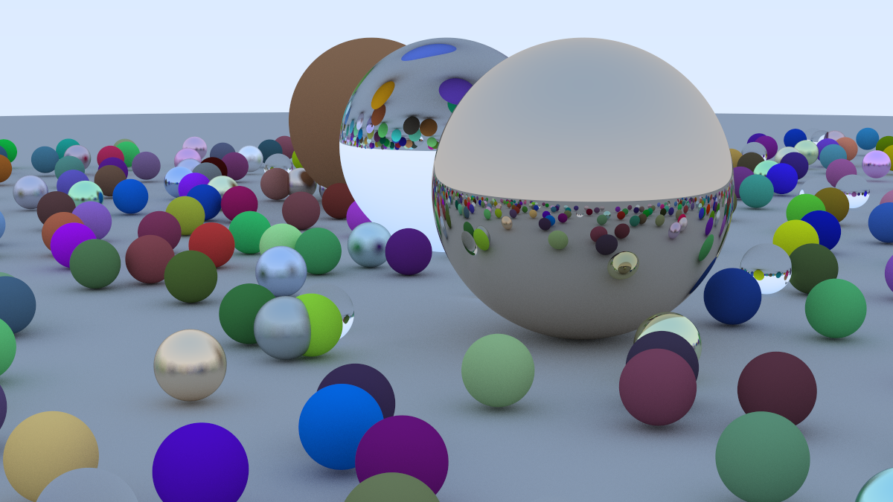

# Ray Tracing in C++

Based on [_Ray Tracing in One Weekend_](https://raytracing.github.io/books/RayTracingInOneWeekend.html).



To run:

```shell
make  && ./main > image.ppm && open image.ppm
```
